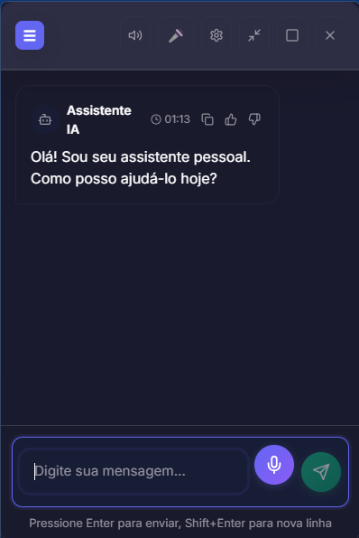
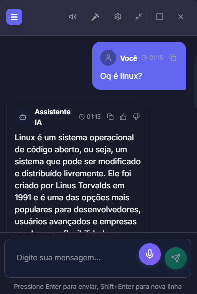
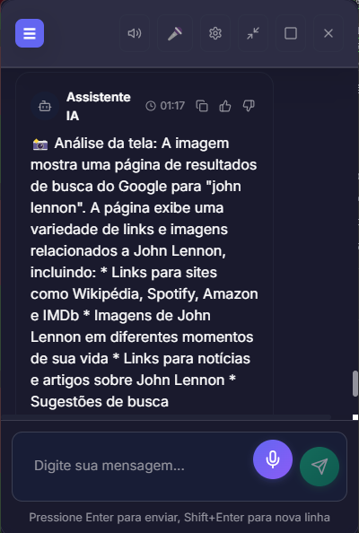

# AI Assistant - Personal Assistant with GROQ

An intelligent personal assistant for PC developed with Electron + React on the frontend and Node.js on the backend, integrating GROQ for natural language processing and AI.

## Screenshots







## Features

### Voice Recognition
- Real-time voice recognition using Web Speech API
- Multi-language support (Portuguese, English, Spanish)
- Volume control and voice settings

### Artificial Intelligence
- GROQ integration for command processing
- Sentiment analysis and context understanding
- Intelligent web searches
- Contextual and personalized responses

### Music Player
- Local file playback
- Playlist control
- Music folder integration
- Volume and navigation controls

### System Control
- Application launching
- System volume control
- Safe command execution
- System resource monitoring

### Chat Interface
- Real-time chat with the assistant
- Conversation history
- Modern and responsive interface
- Text and voice support

## Technologies Used

### Frontend
- **Electron** - Desktop application
- **React** - User interface
- **Framer Motion** - Animations
- **Tailwind CSS** - Styling
- **Lucide React** - Icons

### Backend
- **Node.js** - Server
- **Express** - Web framework
- **GROQ SDK** - AI integration
- **CORS** - Frontend-backend communication

### AI and Processing
- **GROQ** - Natural language processing
- **Web Speech API** - Voice recognition
- **Text-to-Speech** - Voice synthesis

## Installation

### Prerequisites
- Node.js 16+
- npm or yarn
- GROQ API Key

### 1. Clone the repository
```bash
git clone <repository-url>
cd ai-assistente
```

### 2. Install dependencies
```bash
# Install dependencies for all projects
npm run install:all

# Or install individually
npm install
cd backend && npm install
cd ../frontend && npm install
```

### 3. Configure environment variables
```bash
# Copy the example file
cp backend/env.example backend/.env

# Edit the .env file and add your GROQ key
GROQ_API_KEY=your_groq_key_here
PORT=3001
NODE_ENV=development
```

### 4. Get a GROQ key
1. Visit [https://console.groq.com/](https://console.groq.com/)
2. Create an account or log in
3. Generate a new API key
4. Add the key to the `.env` file

## Running the Project

### Development
```bash
# Run frontend and backend simultaneously
npm run dev

# Or run separately
npm run dev:backend  # Backend on port 3001
npm run dev:frontend  # Frontend on port 3000
```

### Production
```bash
# Build frontend
npm run build:frontend

# Build Electron
npm run build:electron

# Run application
npm start
```

## How to Use

### 1. Start the Assistant
- Run the command `npm run dev`
- The Electron application will open automatically

### 2. Configure Voice
- Access settings (gear icon)
- Configure language and voice speed
- Test voice recognition

### 3. Voice Commands
- Click the microphone to start listening
- Say commands like:
  - "Open the browser"
  - "Play a song"
  - "Search about artificial intelligence"
  - "Increase volume"
  - "Analyze my screen"
  - "Screenshot"
  - "Open Steam"

### 4. Chat Interface
- Type messages in the text box
- Use the microphone for voice commands
- Navigate between tabs: Chat, System, Music

## Configuration

### Voice Settings
- Language: Portuguese (Brazil), English, Spanish
- Speed: 0.5x to 2.0x
- Volume: 0% to 100%

### System Settings
- Start with Windows
- Minimize to tray
- Automatic updates

### Privacy Settings
- Data collection
- Analytics
- Crash reports

## Project Structure

```
ai-assistente/
├── backend/                 # Node.js server
│   ├── routes/             # API routes
│   │   ├── ai.js          # GROQ integration
│   │   ├── system.js      # System control
│   │   └── music.js       # Music player
│   ├── server.js          # Main server
│   └── package.json       # Backend dependencies
├── frontend/               # Electron + React application
│   ├── src/
│   │   ├── components/     # React components
│   │   ├── services/       # API services
│   │   ├── App.js         # Main component
│   │   └── index.js       # Entry point
│   ├── public/
│   │   ├── electron.js    # Electron main process
│   │   └── preload.js     # Preload script
│   └── package.json       # Frontend dependencies
├── package.json           # Main scripts
└── README.md              # This file
```

## Development

### Adding New Commands
1. Edit `backend/routes/ai.js`
2. Add new action types in the GROQ prompt
3. Implement the logic in the frontend

### Customizing the Interface
1. Modify components in `frontend/src/components/`
2. Adjust styles in `frontend/src/App.css`
3. Configure Tailwind in `frontend/tailwind.config.js`

### Integrating New APIs
1. Add dependencies in `backend/package.json`
2. Create new routes in `backend/routes/`
3. Implement services in the frontend

## Troubleshooting

### GROQ Connection Error
- Verify that the API key is correct
- Confirm there are credits available in your GROQ account
- Check internet connection

### Voice Issues
- Verify that the microphone is working
- Test in different browsers
- Configure microphone permissions

### Build Error
- Clear cache: `npm run clean`
- Reinstall dependencies: `npm run install:all`
- Check Node.js versions

## License

This project is licensed under the MIT License. See the `LICENSE` file for more details.

## Upcoming Features

- [ ] Spotify/YouTube Music integration
- [ ] More complex command recognition
- [ ] Calendar and tasks integration
- [ ] Multiple profile support
- [ ] Plugins and extensions
- [ ] External AI assistant integration